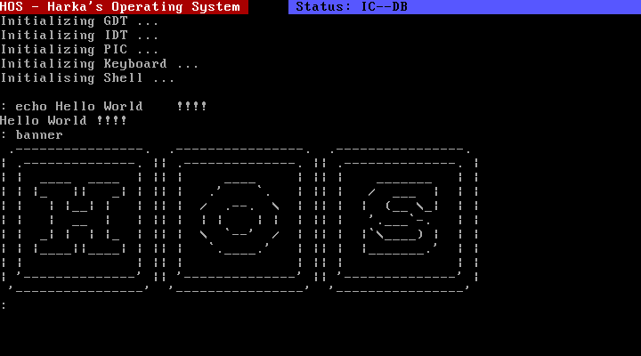

# HOS (HARKA'S OPERATING SYSTEM)

This is a simple 1000LOC operating system for x86. You can use it
for teaching purposes or for learning how to create an operating
system.

Lines of code:

    $ find . -iregex '.*\.[csh]' | xargs wc -l
       97 ./hos/algorithm/sync.c
       75 ./hos/algorithm/sync.h
       17 ./hos/algorithm/string.c
        7 ./hos/algorithm/string.h
       15 ./hos/algorithm/types.h
       31 ./hos/kernel/32.h
       91 ./hos/kernel/32s.s
      245 ./hos/kernel/32c.c
       60 ./hos/kernel/kernel.c
       15 ./hos/kernel/kernel.h
       26 ./hos/kernel/public.h
       15 ./hos/kernel/config.h
      139 ./hos/drivers/screen.c
       24 ./hos/drivers/screen.h
      124 ./hos/drivers/keyboard.c
        9 ./hos/drivers/keyboard.h
       11 ./hos/hos.h
       54 ./topbar.c
       30 ./banner.c
       67 ./shell.c
     1152 total

## Dependencies

For building you need a 32 bit compiler, in debian you can install it with:

    $ sudo apt-get -y install make gcc-multilib binutils libc6-dev-i386

To create the ISO image (required for executing with *qemu*) you will
need *grub*, *xorriso*, *mtools*, *grub-pc-bin*.

    $ sudo apt-get -y install xorriso mtools grub-pc-bin

To be able to execute the OS, you need qemu.

    $ sudo apt-get -y install qemu-system-x86

## Building

Once you have all the dependencies you only need to execute make.

    $ make
    # Will create hos.bin
    # Will create hos.iso

## Testing

    $ qemu-system-i386 -display sdl -M pc -k es -cdrom hos.iso
    or
    $ ./bin/test

## Collaborating

For making bug reports, feature requests and donations visit
one of the following links:

1. [gemini://harkadev.com/oss/](gemini://harkadev.com/oss/)
2. [https://harkadev.com/oss/](https://harkadev.com/oss/)
